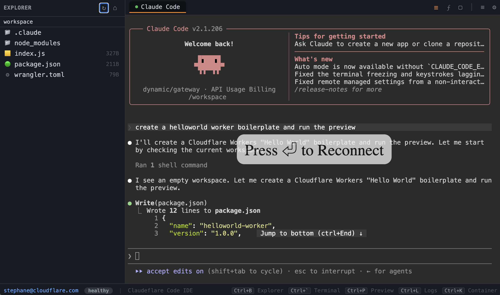
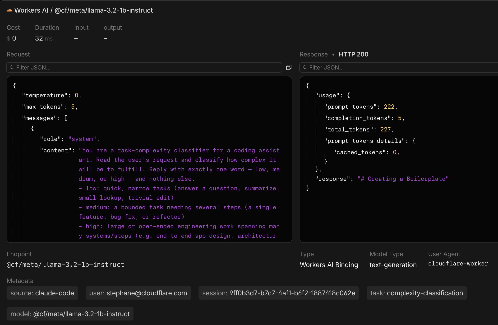

# Claudeflare Code

[](https://deploy.workers.cloudflare.com/?url=https://github.com/nouvellonsteph/claudeflare-code)

Per-user [Claude Code](https://docs.anthropic.com/en/docs/claude-code) web terminals running in [Cloudflare Containers](https://developers.cloudflare.com/containers/), with all API calls routed through [AI Gateway](https://developers.cloudflare.com/ai-gateway/) for observability, caching, and cost control.

Each user gets their own isolated container instance, authenticated via [Cloudflare Access](https://developers.cloudflare.com/cloudflare-one/policies/access/). No shared state between users. No direct Anthropic API access from containers.

<p align="center">
  
</p>

## Architecture

Claudeflare Code gives each user an isolated Claude Code terminal in the browser, with every AI call invisibly routed through AI Gateway.

<p align="center">
  
</p>

User side: Browser authenticates via Cloudflare Access. The Worker maps the user's email to a Durable Object, which manages a dedicated container running ttyd + Claude Code CLI.

The trick: Claude Code thinks it's talking to Anthropic, but ANTHROPIC_BASE_URL points to http://anthropic.proxy — a fake hostname. When Claude Code fetches that destination, Cloudflare Containers' outboundByHost intercepts the outbound request at the Worker layer. The interceptor translates Anthropic format to OpenAI format, injects per-user metadata (email, session ID, complexity), clamps tokens, and forwards to AI Gateway's /compat endpoint via fetch().

Why this matters: AI Gateway handles model routing, so you can swap the backing LLM without touching any code. Every request is logged with user identity and session context. A lightweight Workers AI model classifies task complexity in the background for cost analysis. Identical prompts are cached for 5 minutes at the edge.

Claude Code never has real API credentials. The container has a fake sk-ant- key that passes local validation. Real auth happens in the Worker via the cf-aig-authorization header.

## What it does

- **Isolated terminals**: Each authenticated user gets their own container running `ttyd` + Claude Code CLI, keyed by their email address.
- **API proxy**: All Claude Code API calls are intercepted at the container boundary via `outboundByHost`, translated from Anthropic format to OpenAI format, and forwarded through AI Gateway.
- **Observability**: Every request is tagged with user identity metadata in AI Gateway, giving you per-user usage visibility.
- **Complexity tagging**: Each request is classified as `low`/`medium`/`high` complexity by a small, fast Workers AI model and tagged as AI Gateway custom metadata — transparent to the user, useful for cost/usage analysis.
- **Caching**: Identical prompts are cached at the AI Gateway edge for 5 minutes, reducing latency and cost.
- **Cost control**: `max_tokens` is clamped to a configurable ceiling (default 8192) regardless of what Claude Code requests.

## Cloudflare services used

| Service | Role |
|---------|------|
| [Workers](https://developers.cloudflare.com/workers/) | HTTP routing, auth middleware, API proxy |
| [Containers](https://developers.cloudflare.com/containers/) | Per-user isolated Claude Code terminals |
| [Durable Objects](https://developers.cloudflare.com/durable-objects/) | Container lifecycle, user state (SQLite) |
| [AI Gateway](https://developers.cloudflare.com/ai-gateway/) | Model routing, logging, caching, rate limiting |
| [Workers AI](https://developers.cloudflare.com/workers-ai/) | Fast task-complexity classification for AI Gateway metadata |
| [Access](https://developers.cloudflare.com/cloudflare-one/policies/access/) | Zero Trust authentication (JWT) |

## Prerequisites

- [Cloudflare account](https://dash.cloudflare.com/) with Workers Paid plan
- [Cloudflare Containers](https://developers.cloudflare.com/containers/) enabled (beta)
- [AI Gateway](https://developers.cloudflare.com/ai-gateway/) configured with at least one provider
- [Cloudflare Access](https://developers.cloudflare.com/cloudflare-one/policies/access/) application for the worker domain
- [Docker Desktop](https://www.docker.com/products/docker-desktop/) (for building container images)
- Node.js 18+

## Setup

### 1. Clone and install

```bash
git clone https://github.com/cloudflare/claudeflare-code.git
cd claudeflare-code
npm install
```

### 2. Configure

Edit `wrangler.jsonc` with your values:

| Variable | Description |
|----------|-------------|
| `GATEWAY_ID` | Your AI Gateway slug (from the AI Gateway dashboard) |
| `CLOUDFLARE_ACCOUNT_ID` | Your Cloudflare account ID |
| `AIG_PROXY_URL` | The public URL of this worker (update after first deploy) |
| `CF_ACCESS_AUD` | Audience tag from your Access application |
| `CF_ACCESS_CERTS_URL` | JWKs URL from your Access team (`https://<team>.cloudflareaccess.com/cdn-cgi/access/certs`) |

Copy `.dev.vars.example` to `.dev.vars` and set your secret for local dev:

```bash
cp .dev.vars.example .dev.vars
```

### 3. Deploy

```bash
npm run deploy
```

The first deploy builds the Docker image and pushes it to Cloudflare's container registry. This takes a few minutes.

### 4. Set secrets

```bash
npx wrangler secret put CF_AIG_TOKEN
```

Paste your AI Gateway authentication token when prompted. This token needs the "Run" permission on your gateway.

### 5. Configure Access

Create a Cloudflare Access application for your worker domain (`<name>.<subdomain>.workers.dev`) in the [Zero Trust dashboard](https://one.dash.cloudflare.com/). Update `CF_ACCESS_AUD` and `CF_ACCESS_CERTS_URL` in `wrangler.jsonc` if they changed, then redeploy.

### 6. Open

Navigate to your worker URL. Cloudflare Access will prompt you to authenticate, then you'll see the terminal. Type `claude` to start a Claude Code session.

## Project structure

```
claudeflare-code/
├── src/
│   └── index.ts              # Worker: routes, auth, proxy, container class, UI
├── container_src/
│   ├── entrypoint.sh          # Container startup: ttyd on port 8080
│   └── claude-settings.json   # Claude Code model configuration
├── Dockerfile.claude-code     # Container image: node + ttyd + claude-code CLI
├── wrangler.jsonc              # Wrangler config (fill in your values)
├── .dev.vars.example          # Secret template (copy to .dev.vars)
├── package.json
├── tsconfig.json
├── ARCHITECTURE.md            # Detailed technical architecture
└── AGENTS.md                  # How the AI agent pipeline works
```

## Keyboard shortcuts

| Shortcut | Action |
|----------|--------|
| `Ctrl+L` | Toggle proxy logs panel |
| `Ctrl+K` | Toggle container management panel |
| `Ctrl+D` | Destroy container (with confirmation) |

## How the proxy works

Claude Code CLI inside the container sends Anthropic Messages API requests to `http://anthropic.proxy` (configured via `ANTHROPIC_BASE_URL`). The container's outbound traffic is intercepted by `outboundByHost` and routed through the AIG proxy, which:

1. Extracts user identity via DO RPC (`getUserEmail()`)
2. Classifies the task's complexity (`low`/`medium`/`high`) with a small Workers AI model, for AI Gateway metadata only — never altering the request
3. Translates Anthropic format to OpenAI Chat Completions format
4. Clamps `max_tokens` to `MAX_TOKENS_CEILING` (8192)
5. Forwards to AI Gateway with auth, metadata (including complexity), and cache headers
6. Translates the OpenAI response back to Anthropic format

See [ARCHITECTURE.md](ARCHITECTURE.md) for the full technical breakdown.

### AI Gateway metadata

Every request is tagged with structured metadata visible in the AI Gateway dashboard: source, user identity, session ID, task type, and complexity classification.

<p align="center">
  
</p>

## Configuration

### Container settings

In `wrangler.jsonc`:

- `instance_type`: Container size (`standard-1` by default)
- `max_instances`: Maximum concurrent containers (20 by default)
- `sleepAfter`: Container idle timeout (`10m` in `src/index.ts`)

### Proxy settings

In `src/index.ts`:

- `MAX_TOKENS_CEILING`: Maximum tokens per response (8192)
- Cache TTL: AI Gateway cache duration (300s / 5 minutes via `cf-aig-cache-ttl` header)
- `COMPLEXITY_MODEL`: Workers AI model used for complexity classification (`@cf/meta/llama-3.2-1b-instruct` by default)
- `COMPLEXITY_ROLLOUT`: Single on/off + sample-rate control for complexity classification — set `enabled: false` to disable for everyone, or tune `sampleRate` (0–1) to roll it out to a fraction of requests (deterministic per-user, not per-request)

## License

Apache 2.0 — see [LICENSE](LICENSE).
